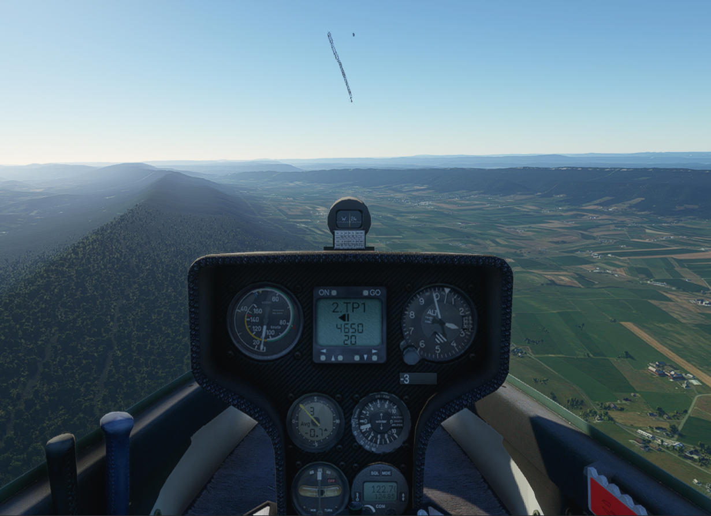

# FSX DG808S upgrade to MSFS

## Things to do

* Implement TE for Winter vario, inject TE into sim as SimVar - DONE

* Make Polar Analysis tool using simconnect (another repo), similar to [B21 Analysis](https://github.com/xp-soaring/B21_Analysis) - kinda DONE, MSFS a bit flakey.

* Get DG808S polar correct at zero flap - WIP

* get flaps working (i.e. with correct polar) - WIP

* get water ballast working (i.e. with correct polar) (water dump effect possible?) - will release without water ballast.

* Implement Netto on Cambridge 302 vario - DONE

* Implement Speed-to-Fly on Cambridge 302 vario (auto-switch Netto / STF thermal/cruise?) - NETTO & auto-switch DONE, will release without STF

* Implement NAV on panel, using flightplan. - DONE

## Some development pointers

### Simconnect

* [Simconnect from Golang: lian](https://github.com/lian/msfs2020-go)
* [Another Golang simconnect: micmonay](https://github.com/micmonay/simconnect)

